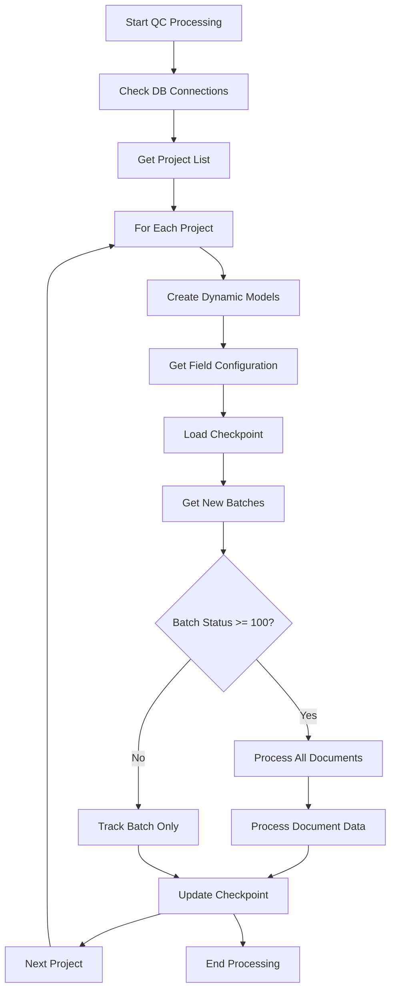
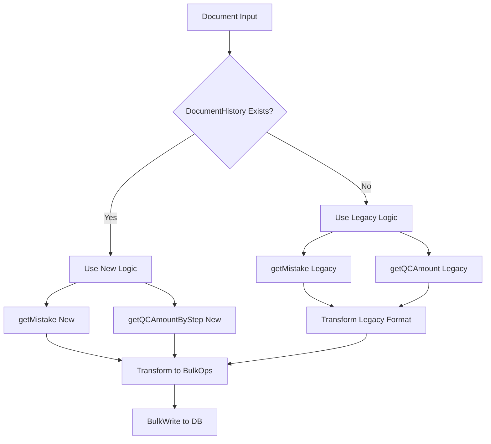

# QC Data Processing Job - Document Chi Tiết

## 1. Tổng quan

QC Data Processing Job là một cron job quan trọng trong hệ thống, chạy mỗi giờ (phút thứ 5) để thu thập và xử lý dữ liệu chất lượng từ các document/batch đã hoàn thành. Job này tạo ra hai loại báo cáo chính:

- **Mistake Details**: Chi tiết lỗi nhập liệu (so sánh giữa các step khác nhau)
- **Keying Amount**: Số lượng thao tác nhập liệu (characters, fields, records, lines)

### 1.1. Điểm khác biệt với phiên bản cũ
- **Collection động theo project**: Mỗi project có collection riêng để tối ưu performance
- **Batch-based tracking**: Theo dõi batch thay vì từng document
- **Schema chuẩn hóa**: Sử dụng schema đầy đủ cho tất cả collection
- **Fallback logic**: Hỗ trợ cả logic mới và legacy
- **Memory optimization**: Xử lý theo batch để tránh memory leak

## 2. Cấu trúc Database & Collection

### 2.1. Database Connections
- **defaultConnection**: Chứa project plan, field configuration, checkpoint, mistake details, keying amount
- **primaryConnection**: Chứa document data, batch data, document history

### 2.2. Collection Dynamics
#### Mistake Details Collection
```
Format: {projectId}_mistake_details
Schema: mistakeDetailsSchema
```

#### Keying Amount Collection
```
Format: {projectId}_keying_amount  
Schema: keyingAmountSchema
```

#### Static Collections
- `field_configuration`: Cấu hình field (defaultConnection)
- `processing_checkpoint`: Checkpoint theo project
- `incomplete_doc_tracking`: Theo dõi batch chưa hoàn thành

### 2.3. Field Configuration Logic
Thay vì lấy từ `field_value_definitions` (primary DB), giờ lấy từ `field_configuration` (default DB):

```javascript
const fieldsNotCounted = await FieldConfigurationModel.find(
    { is_report_count: false, project_id: project._id },
    { field_name: 1, _id: 0 }
).lean();
const fieldNotCount = fieldsNotCounted.map(field => field.field_name);
```

**Cấu trúc field_configuration:**
```javascript
{
    "_id": ObjectId("68516b3099038d08412f1e7e"),
    "field_id": ObjectId("683e62b0c303b3001d4446e4"),
    "field_name": "Birth_Country",
    "field_display": "Birth Country", 
    "is_report_count": true,
    "critical_field": false,
    "project_id": ObjectId("5db5c87345052400142992e9"),
    "project_name": "148_191004_124_MVL_STP_OCR",
    "layout_id": ObjectId("683e62b0c303b3001d444725"),
    "layout_name": "ID_Card1",
    "layout_type": "capture",
    "section_id": ObjectId("683e62c8c303b3001d44474f"),
    "section_name": "ID_Card1",
    "created_at": ISODate("2025-06-17T13:18:40.615+0000"),
    "updated_at": ISODate("2025-06-18T04:49:56.203+0000")
}
```

## 3. Các Hàm Import và Chức Năng

### 3.1. Hàm Chính từ qualityControlServices.js

#### `getMistake(fieldNotCount, document, dataFiltered, documentHistory, sectionMultiRow)`
**Chức năng**: So sánh dữ liệu giữa các step để tìm lỗi
**Input**: 
- `fieldNotCount`: Array field không tính
- `document`: Document MongoDB
- `dataFiltered`: Dữ liệu đã lọc
- `documentHistory`: History document
- `sectionMultiRow`: Array section multi-row

**Logic xử lý**:
1. **assignIdsBuildTaskAndGroupByRecord**: Assign system_record_id và group theo task
2. **compareEnrichData**: So sánh chi tiết giữa các step
3. **buildMistake**: Tạo object mistake theo format chuẩn

**Output**: Array mistake objects
```javascript
{
    task_keyer_name: String,
    task_final_name: String,
    section: String,
    record_idx: String,
    line_idx: String,
    field_name: String,
    user_name_keyer: String,
    user_name_final: String,
    value_keyer: String,
    value_final: String,
    captured_keyer_at: Date,
    captured_final_at: Date,
    layout_name: String,
    error_type: null
}
```

#### `getQCAmountByStep(document, dataFiltered, projectId, batchId, documentHistory, sectionMultiRow, fieldNotCount, qcPattern)`
**Chức năng**: Tính số lượng field, ký tự theo từng step
**Input**: Document, filtered data, project info, patterns
**Logic**: 
1. Group data theo step
2. Count field/character cho từng step
3. Determine is_qc dựa trên QC pattern
4. Tính document-level totals từ final_data

**Output**: Object keying amount
```javascript
{
    project_id: ObjectId,
    batch_id: ObjectId,
    batch_name: String,
    doc_id: ObjectId,
    layout_name: String,
    total_field_document: Number,
    total_character_document: Number,
    total_line_document: Number,
    total_record_document: Number,
    keying_details: [{
        task_keyer_name: String,
        user_name_keyer: String,
        total_field: Number,
        total_character: Number,
        total_records: Number,
        total_lines: Number,
        is_qc: Boolean,
        captured_keyer_at: Date
    }],
    imported_date: Date
}
```

### 3.2. Hàm Legacy từ qualityControlServices-bk.js

#### `getMistake` (Legacy)
**Fallback khi**: `documentHistory` không có hoặc format cũ
**Logic**: So sánh theo cách cũ, không có system_record_id mapping
**Transform**: Convert format cũ sang schema mới

#### `getQCAmount` (Legacy)
**Fallback khi**: `documentHistory` không có hoặc format cũ
**Logic**: Tính field/character theo cách cũ
**Transform**: Convert thành keying_details format mới

### 3.3. QC Pattern Helper

#### `getQcPatterns()`
**Chức năng**: Lấy QC patterns từ DB với cache 15 phút
**Output**: 
```javascript
{
    QC_PATTERN: RegExp,      // Pattern cho QC tasks
    AQC_PATTERN: RegExp,     // Pattern cho AQC tasks  
    COMBINED_PATTERN: RegExp // Combined pattern
}
```
**Fallback**: Nếu DB không có, sử dụng pattern mặc định

## 4. Logic Xử Lý Chi Tiết

### 4.1. Luồng Chính processQCData()



### 4.2. Xử Lý Document Chi Tiết



### 4.3. Checkpoint & Batch Tracking

**Checkpoint Logic**:
- Track `last_batch_id` đã xử lý
- Chỉ xử lý batch mới hơn checkpoint
- Update checkpoint sau khi hoàn thành

**Batch Status Logic**:
```javascript
if (batch.status >= 100) {
    // Batch completed -> process all documents
    processAllDocuments(batch);
} else {
    // Batch incomplete -> track only
    trackIncompleBatch(batch);
}
```

## 5. Cấu Trúc Dữ Liệu Ghi Vào DB

### 5.1. Mistake Details Schema
```javascript
const mistakeDetailsSchema = {
    project_id: ObjectId,      // Required
    batch_id: ObjectId,        // Required  
    doc_id: ObjectId,          // Required
    batch_name: String,
    imported_date: Date,
    s2_url: String,           // Joined by "|"
    mistake_details: [{       // Array of mistake objects
        task_keyer_name: String,
        task_final_name: String,
        section: String,
        record_idx: String,
        line_idx: String,
        field_name: String,
        user_name_keyer: String,
        user_name_final: String,
        value_keyer: String,
        value_final: String,
        captured_keyer_at: Date,
        captured_final_at: Date,
        layout_name: String,
        error_type: String,    // Default null
        error_found_at: String, // 'qc' or 'verify'
        status: String,        // WAIT_QC, WAIT_PM, etc.
        reason: Array          // History tracking
    }]
}
```

### 5.2. Keying Amount Schema
```javascript
const keyingAmountSchema = {
    project_id: ObjectId,           // Required
    batch_id: ObjectId,             // Required
    batch_name: String,             // Required
    doc_id: ObjectId,               // Required
    layout_name: String,
    // Document-level totals
    total_field_document: Number,
    total_character_document: Number,
    total_line_document: Number,
    total_record_document: Number,
    // Step details
    keying_details: [{
        task_keyer_name: String,
        user_name_keyer: String,
        total_field: Number,
        total_character: Number,
        total_records: Number,
        total_lines: Number,
        is_qc: Boolean,
        captured_keyer_at: Date
    }],
    imported_date: Date
}
```

## 6. Fallback Logic & Error Handling

### 6.1. DocumentHistory Fallback
```javascript
let useLegacy = false;
if (DocumentHistoryModel) {
    documentHistory = await DocumentHistoryModel.find({ doc_id: doc._id.toString() }).lean();
    if (!documentHistory || documentHistory.length === 0 || !documentHistory[0].keyed_data) {
        useLegacy = true;
    }
} else {
    useLegacy = true;
}
```

### 6.2. Pattern Fallback
```javascript
// Từ qcPatternHelper.js
const { QC_PATTERN, AQC_PATTERN, COMBINED_PATTERN } = await getQcPatterns();

// Nếu DB không có pattern, sử dụng default:
{
    QC_PATTERN: /qc|_qc_|_qc|qc_|quality_check/i,
    AQC_PATTERN: /_qca_|_aqc_|approve_mistake|_confirm|confirm_/i,
    COMBINED_PATTERN: /qc|_qc_|_qc|qc_|quality_check|_qca_|_aqc_|approve_mistake|_confirm|confirm_/i
}
```

### 6.3. Error Recovery
- **Connection errors**: Kiểm tra readyState trước khi xử lý
- **Memory management**: Force garbage collection
- **Timeout protection**: 55 phút timeout cho mỗi run
- **Overlap prevention**: Flag `isJobRunning` để tránh chồng chéo

## 7. Performance Optimization

### 7.1. Dynamic Collections
- Mỗi project có collection riêng: `{projectId}_mistake_details`, `{projectId}_keying_amount`
- Giảm kích thước index, tăng tốc độ query

### 7.2. Batch Processing
```javascript
const BATCH_SIZE = 1000;
// Xử lý theo batch để tránh memory overflow
if (batchDocs.length === BATCH_SIZE) {
    await processBulkWrites(...);
    // Reset batch arrays
}
```

### 7.3. BulkWrite Operations
```javascript
// Gộp nhiều operation thành một lần bulkWrite
await MistakeDetailsModel.bulkWrite(bulkOpsMistake, { ordered: false });
await KeyingAmountModel.bulkWrite(bulkOpsEffort, { ordered: false });
```

### 7.4. Cursor & Streaming
```javascript
// Sử dụng cursor thay vì load all vào memory
const docCursor = DocumentModel.find({ batch_id: batch._id }).lean().cursor();
for await (const doc of docCursor) {
    // Process document
}
```

## 8. Monitoring & Logging

### 8.1. Memory Tracking
```javascript
const memUsage = process.memoryUsage();
loggerInfo.info('[QC Cron Job] Memory usage:', {
    heapUsed: `${Math.round(memUsage.heapUsed / 1024 / 1024)}MB`,
    heapTotal: `${Math.round(memUsage.heapTotal / 1024 / 1024)}MB`
});
```

### 8.2. Progress Tracking
- Log số lượng project, batch, document processed
- Track checkpoint updates
- Monitor bulkWrite operations
- Error logging với stack trace

## 9. Cron Job Configuration

### 9.1. Schedule
```javascript
cron.schedule('5 * * * *', () => {
    // Chạy mỗi giờ vào phút thứ 5
});
```

### 9.2. Startup Behavior
- Chạy ngay một lần khi server startup
- Sử dụng timeout protection
- Auto garbage collection

## 10. Best Practices & Maintenance

### 10.1. Schema Evolution
- Sử dụng proper schema cho tất cả collection
- Có TTL index cho auto cleanup (90 ngày)
- Index optimization cho performance

### 10.2. Error Handling
- Graceful error handling
- Re-throw errors cho caller
- Memory cleanup trong finally block

### 10.3. Scalability
- Dynamic collection theo project
- Batch processing
- Connection pooling
- Checkpoint system

---

## Khởi Chạy Manual

```javascript
// Chạy thủ công
const { processQCData } = require('./qcProcessJob');
processQCData()
    .then(() => console.log('QC Processing completed'))
    .catch(console.error);
```

## Dependencies

- `node-cron`: Cron job scheduling
- `mongoose`: MongoDB ODM
- `lodash`: Utility functions
- Custom helpers: qualityControlServices, connectDB, logger, qcPatternHelper
- Models: mistakeDetails, keyingAmount, fieldConfiguration, checkpoint 